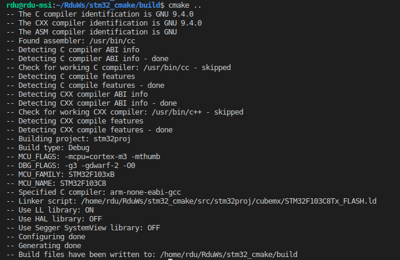
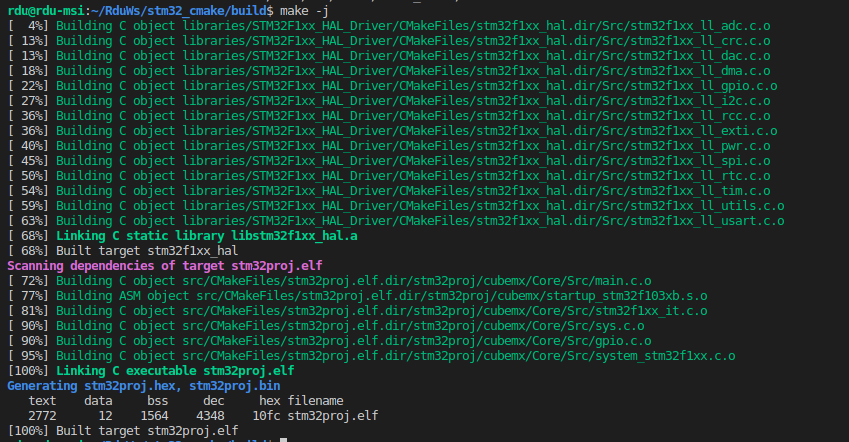

# STM32 CMake Project Template

This template has been tested in Linux. Additional adjustments may be required for use in Windows. 

## How to compile code

**Prerequisite**: 

This cmake setup assumes the gcc-arm-none-eabi toolchain has been set up correctly in your system.

Generally there are two ways to set up the toolchain:

1. Install using the package manager

    ```
    $ sudo apt install gcc-arm-none-eabi
    ```
2. Download the toolchain binaries and add its directory to system path

* Find the binaries from the website: 
  
  https://developer.arm.com/tools-and-software/open-source-software/developer-tools/gnu-toolchain/gnu-rm/downloads

* Add the path in .bashrc (for example, if you put the extracted files at /opt/gcc-arm-none-eabi-7-2017-q4-major-linux)
  
    ```
    $ export PATH=/opt/gcc-arm-none-eabi-7-2017-q4-major-linux/bin:$PATH
    ```

* Make sure you can invoke the toolchain from a terminal

    ```
    $ arm-none-eabi-gcc -v
    ```

Now you can try to compile the sample project using the cmake template.

```
$ cd <root-folder-of-this-repo>
$ mkdir build
$ cmake ../src
$ make
```
If the "cmake ../src" step runs successfully, you should see something similar to the below screenshot:



Then you can continue to actually compile the code and you can expect a similar result:

